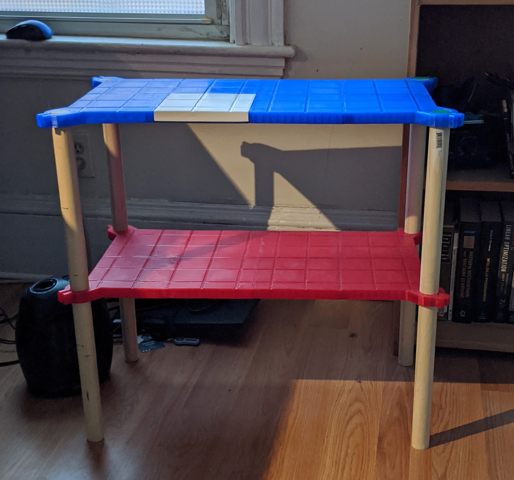
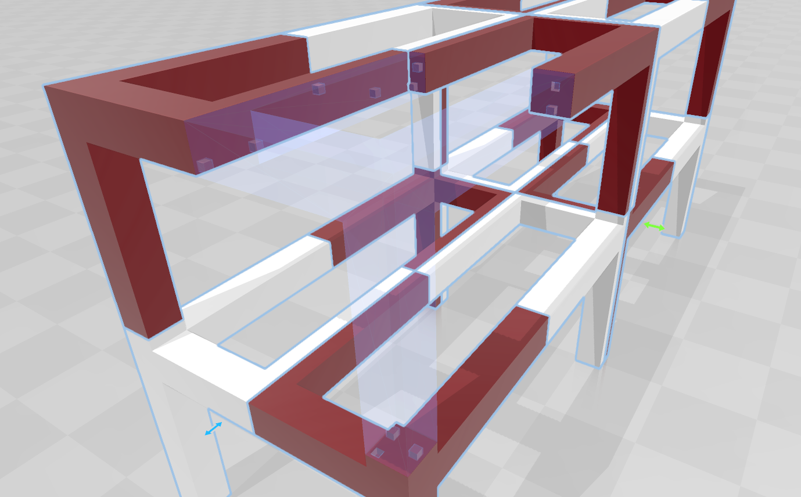
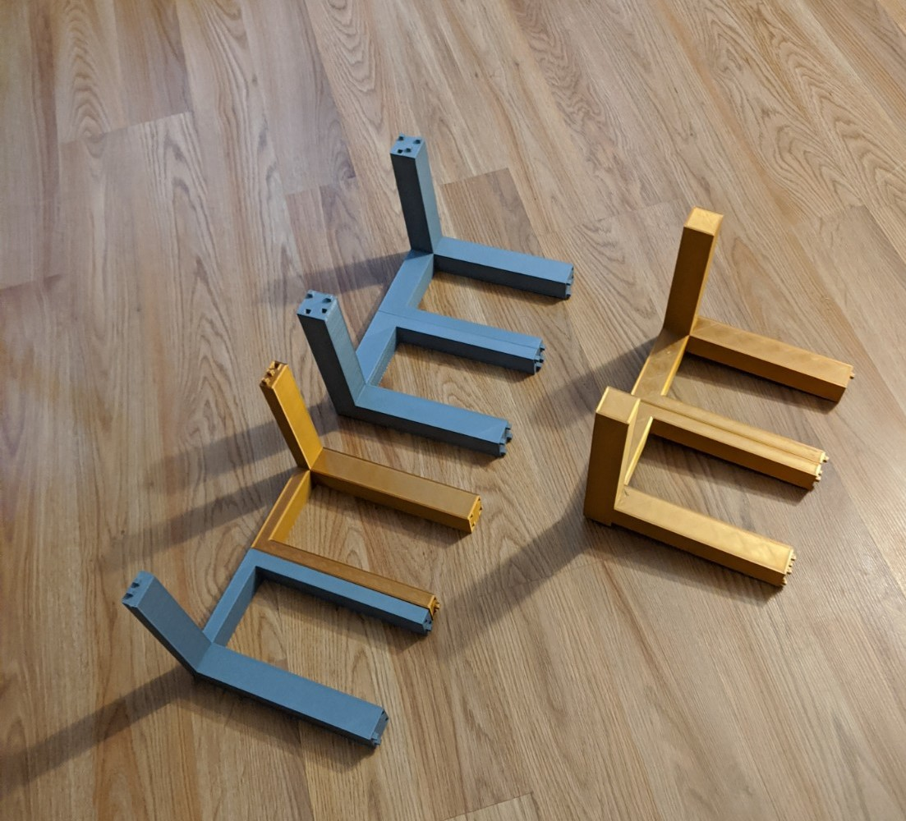
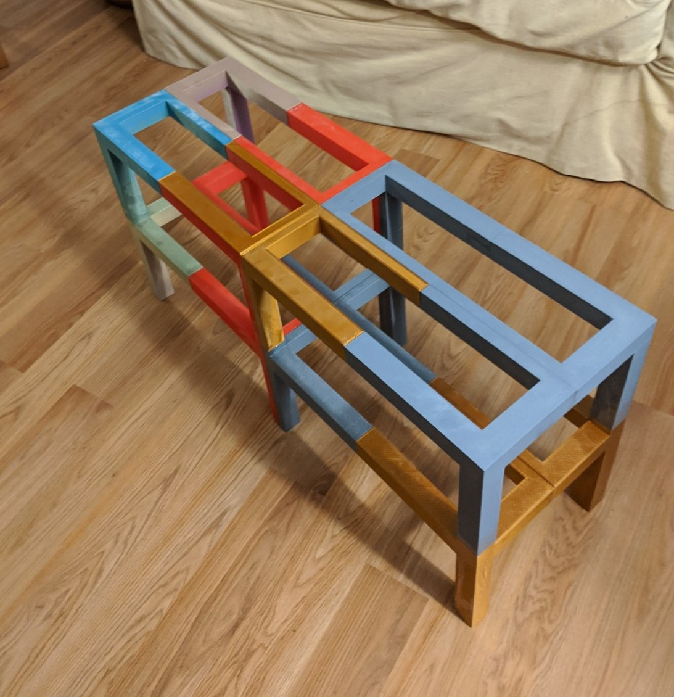

# Chopper: Partitioning Models into 3D-Printable Parts
(not my paper)

### Paper:
http://cfg.mit.edu/content/chopper-partitioning-models-3d-printable-parts

### Usage:
*NOTE: this has only been tested on windows*

*NOTE: Must use python 3.7*

##### download and install Blender 2.79b
https://download.blender.org/release/Blender2.79/blender-2.79-windows64.msi

I think you can download any version 2.79 or higher, but I know it works
with 2.79b
##### clone repo 
`git clone https://github.com/gregstarr/pychop3d.git`
##### enter directory 
`cd pychop3d`
##### create virtual environment 
`python -m venv venv`
##### activate virtual environment 
`venv/Scripts/activate`
##### update pip
`python -m pip install --upgrade pip`
##### install packages 
`pip install -r requirements.txt`
##### install more packages
go to <https://www.lfd.uci.edu/~gohlke/pythonlibs> and download the 
commented out packages from requirements.txt. These packages can be installed
with the command:
`pip install {package_wheel_file}`
where `{package_wheel_file}` is the path to the downloaded wheel file for that 
particular package.
##### Try the example (this uses bunny_config.yml) 
`python main.py`
##### Try out your own STLs by creating a configuration YAML and passing it to main
`python main.py -c my_config.yml`

### Main Configuration Options
* beam_width: increasing this will cause the process to take longer but will (in theory) 
make the output better
* connector_diameter: side length of the connector pegs (cubes)
* connector_spacing: minimum distance between adjacent connectors
* connector_tolerance: extra side length for the 'slots'
* mesh: file path to stl, can also override this on command line in main.py
* part_separation: experimental feature, sometimes helps, sometimes hurts
* printer_extents:  volume of your cartesian printer (currently do not support delta-style printers)
* directory: directory where the output stls, config file, and save progress will be stored a new 
directory will be created within this directory with the 'name' and the datetime string
* name: name of job, this will influence what the name of the output directory is
* plane_spacing: how many planes to consider for each normal, increasing this will cause the process 
to take longer but will possibly make the output better

See bunny_config.yml or shoerack_config.yml for examples

### Gallery:

#### Bunny

Takes about 2 minutes

    
    
    
    
    

#### Table:

#### Shoerack

Takes about 45 minutes

